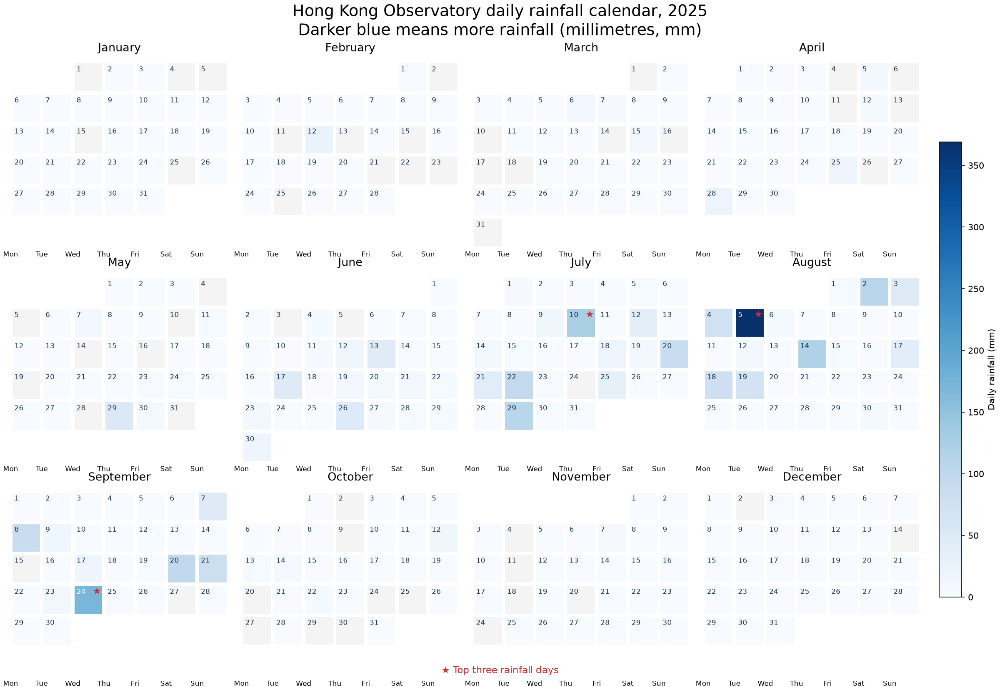
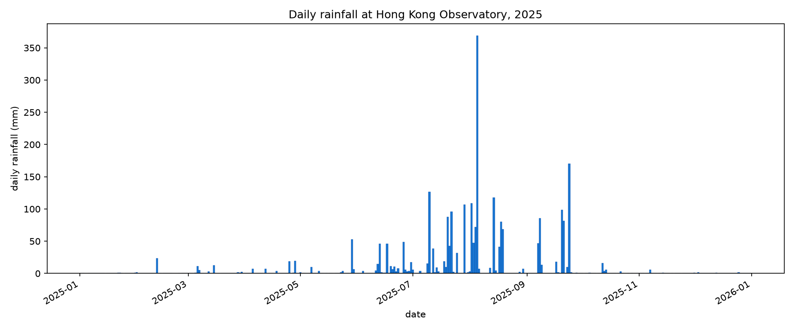

# Hong Kong rainfall



The original daily bar chart is also kept as an initial version:


## The natural phenomenon

This project studies rainfall, the amount of water that falls from clouds to
the ground. Rainfall changes from day to day because of monsoon winds, tropical
cyclones, thunderstorms, and other weather systems. I chose Hong Kong rainfall
because Hong Kong has a clear wet season, occasional very heavy rain, and a
long official record. Understanding these changes is useful for thinking about
flooding, water resources, transport, and daily life.

## The data

The data comes from the [Hong Kong Observatory daily total rainfall
dataset](https://data.gov.hk/en-data/dataset/hk-hko-rss-daily-total-rainfall).
The [direct CSV file](https://data.weather.gov.hk/weatherAPI/cis/csvfile/HKO/ALL/daily_HKO_RF_ALL.csv)
is downloaded by `fetch.py` and saved without changing the server response.
The local file has **49,492 data rows**. Each data row
represents one calendar day recorded at the Hong Kong Observatory station. Its
columns give the year, month, day, rainfall value, and a completeness code.
Rainfall is measured in millimetres (mm). The file also contains headings and
short notes from the Observatory; the plotting program does not treat those
notes as observations. The code reports the official `***` missing-value
marker instead of silently changing it to zero. It also reports `Trace`
entries separately: the Observatory defines these as rainfall below 0.05 mm,
so the chart does not pretend that they have an exact numeric value.

## What the pictures show

The new main picture, `out/rainfall-calendar.png`, shows every day of 2025 in
a calendar layout. Each date has its own square: pale blue means little rain
and darker blue means more daily rainfall. The calendar includes month titles,
weekday labels, a millimetres (mm) colour legend, and red stars marking the
three wettest days. The earlier bar chart, `out/plot.png`, is preserved as an
initial version so the two visual designs can be compared.

Both pictures hide changes within a day, such as hourly rainfall, and they do
not show differences between weather stations in different parts of Hong
Kong. The calendar also gives less visual space to exact values than the
original bars. Days marked `Trace` by the Observatory are not given a made-up
number in the chart.

## Run it

```bash
uv run fetch.py
uv run plot.py
```
